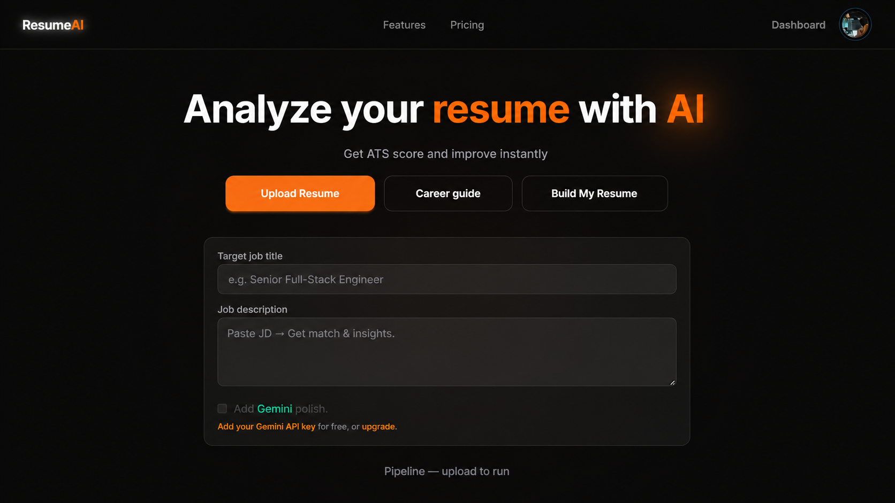
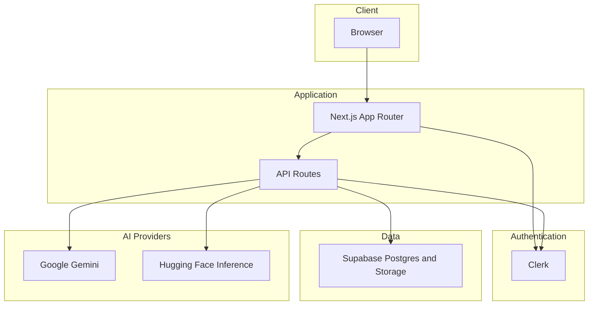

# ResumeAI

<p align="center">
  
</p>

<p align="center">
  <strong>AI-powered Resume Analysis & Career Development Platform</strong>
</p>

<p align="center">
Built with <strong>Next.js</strong>, <strong>Clerk</strong>, <strong>Supabase</strong>,
<strong>Google Gemini</strong>, <strong>Hugging Face</strong> and
<strong>Razorpay</strong>.
</p>

---

ResumeAI helps users analyze resumes with ATS-style scoring, generate personalized career roadmaps, build professional resumes with live preview, and export ATS-friendly PDF resumes.

---

## ✨ Features

- 🔐 Secure Google Authentication with Clerk
- 📄 AI-powered Resume Analysis
- 📊 ATS Score & Improvement Suggestions
- 🧠 AI Career Guide based on user skills
- 📝 Resume Builder with Live Preview
- 📥 ATS-Friendly PDF Export
- ☁️ Resume Storage using Supabase
- 💳 Premium Plans with Razorpay
- 🤖 Google Gemini & Hugging Face AI Integration

---

# 🏗️ Architecture

High-level request flow: the browser talks to Next.js (pages and API routes). Authentication is handled by Clerk. Application data and PDFs live in Supabase. AI calls run on the server only; the client never sees API keys.



---

# 🛠️ Tech Stack

### Frontend

- Next.js 15
- React 19
- TypeScript
- Tailwind CSS
- DaisyUI

### Backend

- Next.js API Routes
- Clerk Authentication
- Supabase PostgreSQL
- Supabase Storage

### AI

- Google Gemini
- Hugging Face Inference API

### Payments

- Razorpay

---

# 📂 Project Structure

```text
ResumeAI/
│
├── public/                 # Static assets & template preview images
├── scripts/                # Utility scripts
├── src/
│   ├── app/                # Next.js App Router
│   ├── assets/             # Images & assets
│   ├── components/         # Reusable UI components
│   ├── data/               # Static data
│   ├── lib/                # Helpers, AI integrations & utilities
│   ├── server/             # Server-side logic
│   ├── types/              # TypeScript types
│   ├── App.css
│   ├── index.css
│   └── middleware.ts       # Clerk authentication middleware
│
├── supabase/               # SQL migrations
├── .env.example
├── package.json
├── next.config.ts
├── tsconfig.json
└── README.md
```

---

# 🚀 Installation

Clone the repository

```bash
git clone <repository-url>
```

Go to the project directory

```bash
cd ResumeAI
```

Install dependencies

```bash
npm install
```

Create a local environment file

```bash
cp .env.example .env.local
```

Run the development server

```bash
npm run dev
```

Open:

```
http://localhost:3000
```

---

# 🔑 Environment Variables

Create a `.env.local` file and configure the following variables:

```env
# Clerk
NEXT_PUBLIC_CLERK_PUBLISHABLE_KEY=
CLERK_SECRET_KEY=

# Supabase
NEXT_PUBLIC_SUPABASE_URL=
NEXT_PUBLIC_SUPABASE_ANON_KEY=
SUPABASE_SERVICE_ROLE_KEY=
DATABASE_URL=

# Google Gemini
GEMINI_API_KEY=

# Hugging Face
HUGGINGFACE_API_TOKEN=

# Razorpay
RAZORPAY_KEY_ID=
RAZORPAY_KEY_SECRET=
RAZORPAY_PRO_AMOUNT_PAISE=10000
RAZORPAY_CURRENCY=INR
```

---

# 🗄️ Database Setup

Run all SQL migration files inside:

```
supabase/migrations/
```

Verify that:

- Database tables are created
- Resume storage bucket exists
- Supabase credentials are configured correctly

---

# 🤖 AI Providers

### Free Plan

- Hugging Face Inference API
- Resume Analysis
- Career Guide

### User API Key

- Uses the user's own Google Gemini API Key
- Unlocks advanced AI features without requiring a paid subscription

### Pro Plan

- Server-side Google Gemini
- Deep ATS Analysis
- Unlimited Resume Analysis
- Premium AI Features

---

# 💳 Premium Features

- Unlimited Resume Analysis
- Advanced ATS Reports
- AI Resume Enhancement
- Unlimited Resume Storage
- Priority Processing

Payments are securely handled using **Razorpay**.

---

# 📜 Available Scripts

| Command | Description |
|----------|-------------|
| `npm run dev` | Start development server |
| `npm run build` | Create production build |
| `npm run start` | Run production build |
| `npm run lint` | Run ESLint |
| `npm run clean` | Clear Next.js cache |

---

# 📄 License

This project is intended for educational, learning, and portfolio purposes.